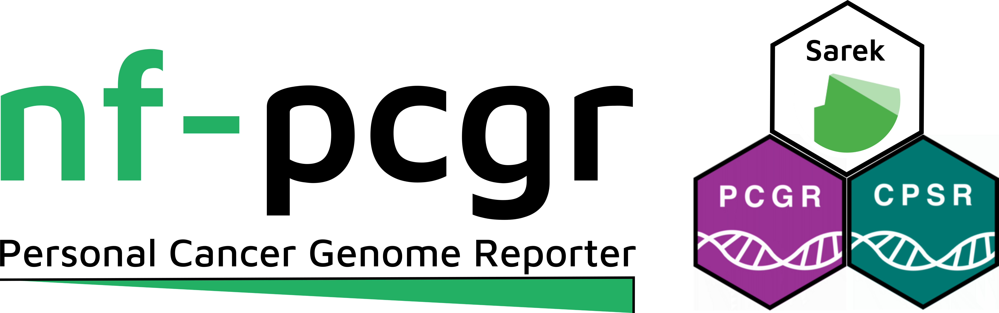
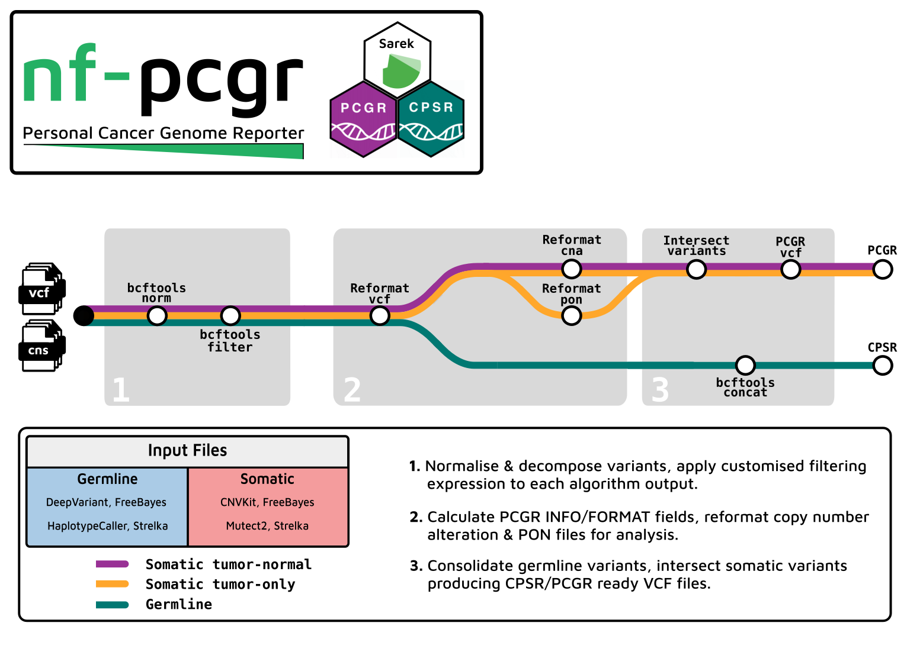

# 

## Introduction

**nf-pcgr** is a bioinformatics analysis pipeline for the functional annotation and translation of somatic SNVs/InDels and copy number abberations for precision cancer medicine using [Personal Cancer Genome Reporter (PCGR)](https://github.com/sigven/pcgr). **nf-pcgr** offers germline SNVs/INDELS intepretation and annotation using [Cancer Predisposition Sequencing Reporter (CPSR)](https://github.com/sigven/cpsr/).

The workflow has been designed to accept outputs generated by [nf-core/sarek](https://github.com/nf-core/sarek):

| Tool                   |      Germline      | Somatic tumor-normal | Somatic tumor-only |
| ---------------------- | :----------------: | :------------------: | :----------------: |
| CNVkit                 |                    |  :heavy_check_mark:  | :heavy_check_mark: |
| DeepVariant            | :heavy_check_mark: |                      |                    |
| FreeBayes              | :heavy_check_mark: |  :heavy_check_mark:  | :heavy_check_mark: |
| HaplotypeCaller        | :heavy_check_mark: |                      |                    |
| Mutect2                |                    |  :heavy_check_mark:  | :heavy_check_mark: |
| Strelka somatic indels |                    |  :heavy_check_mark:  |                    |
| Strelka somatic snvs   |                    |  :heavy_check_mark:  |                    |
| Strelka variants       | :heavy_check_mark: |                      | :heavy_check_mark: |


## Pipeline summary

# 

## Quick Start

1. Install [`Nextflow`](https://www.nextflow.io/docs/latest/getstarted.html#installation) (`>=22.10.4`)

2. Install [`Docker`](https://docs.docker.com/engine/installation/) or [`Singularity`](https://www.sylabs.io/guides/3.0/user-guide/)

3. Download and unpack the human assembly-specific data bundle (grch38 for test-data):

- [grch37 data bundle](http://insilico.hpc.uio.no/pcgr/pcgr.databundle.grch37.20220203.tgz) - 20220203 (approx 20Gb)

- [grch38 data bundle](http://insilico.hpc.uio.no/pcgr/pcgr.databundle.grch38.20220203.tgz) - 20220203 (approx 21Gb)

```bash
GENOME="grch38" # or "grch37"
BUNDLE_VERSION="20220203"
BUNDLE="pcgr.databundle.${GENOME}.${BUNDLE_VERSION}.tgz"

wget http://insilico.hpc.uio.no/pcgr/${BUNDLE}
gzip -dc ${BUNDLE} | tar xvf -
```

> Pass the directory containing the uncompressed `data/` directory to **nf-pcgr** using the `--database` parameter for both `PCGR` and `CPSR`.

3. Download the pipeline and test it on a minimal dataset with a single command:

```console
nextflow pull BarryDigby/nf-pcgr
nextflow run BarryDigby/nf-pcgr -profile test,<docker/singularity> --database '<path to PCGR database>'
```

> Re-run the command if you encounter a `FileNotFoundError` - the test data did not fully download prior to workflow execution.

## Parameter documentation

Detailed descriptions of parameters can be found at [parameters.md](docs/parameters.md) or by running `nextflow run BarryDigby/nf-pcgr --help`.
## Usage

### Input samplesheet

The workflow accepts as input a `samplesheet.csv` file containing the paths to SNV/InDel VCF files and `CNVKit` copy number abberation `.cns` files. We have efforted to mimick the [samplesheet specifications of nf-core/sarek](https://github.com/nf-core/sarek/blob/master/docs/usage.md#input-sample-sheet-configurations) for ease of use:

| Column  |                                                      Description                                                     |
|---------|:---------------------------------------------------------------------------------------------------------------------|
| patient |      Designates the patient/subject; must be unique for each patient, but one patient can have multiple samples      |
| status  |                                             Normal/tumor (0/1) status of sample                                      |
| sample  | Designates the sample ID; must be unique. A patient may have multiple samples e.g a paired tumor-normal, tumor-only. |
| vcf     |                                               Full path to VCF file(s)                                               |
| cna     |                                                 Full path to CNS file                                                |

***

An example of a valid samplesheet is given below:

```bash
patient,status,sample,vcf,cna
HCC1395,1,HCC1395T,HCC1395T_vs_HCC1395N.mutect2.vcf.gz,HCC1395T.cns
HCC1395,1,HCC1395T,HCC1395T_vs_HCC1395N.freebayes.vcf.gz,HCC1395T.cns
HCC1395,1,HCC1395T,HCC1395T_vs_HCC1395N.strelka.somatic_snvs.vcf.gz,HCC1395T.cns
HCC1395,1,HCC1395T,HCC1395T_vs_HCC1395N.strelka.somatic_indels.vcf.gz,HCC1395T.cns
HCC1395,0,HCC1395N,HCC1395N.deepvariant.vcf.gz,
HCC1395,0,HCC1395N,HCC1395N.freebayes.vcf.gz,
HCC1395,0,HCC1395N,HCC1395N.haplotypecaller.vcf.gz,
HCC1395,0,HCC1395N,HCC1395N.strelka.variants.vcf.gz,
HCC1396,1,HCC1396T,HCC1396T_vs_HCC1396N.mutect2.vcf.gz,
HCC1396,1,HCC1396T,HCC1396T_vs_HCC1396N.freebayes.vcf.gz,
HCC1396,1,HCC1396T,HCC1396T_vs_HCC1396N.strelka.somatic_snvs.vcf.gz,
HCC1396,1,HCC1396T,HCC1396T_vs_HCC1396N.strelka.somatic_indels.vcf.gz,
```

### File names

Input VCF file names must contain a string denoting the variant calling tool used to detect variants between the first and second period character:

> `HCC1396T_vs_HCC1396N.freebayes.vcf.gz`

This is the default naming convention of nf-core/sarek, thus if your VCF files originate from a different workflow you must add them prior to running nf-pcgr. Accepted strings are `deepvariant, freebayes, haplotypecaller, mutect2`.

For files generated by `Strelka`, the workflow will consider the text between the first and third period characters: `strelka.variants, strelka.somatic_indels, strelka.somatic_snvs`:

> `HCC1396T_vs_HCC1396N.strelka.somatic_indels.vcf.gz`


## Sample outputs

### PCGR


### CPSR


## Credits

nf-core/pcgr was originally written by Barry Digby.

We thank the following people for their extensive assistance in the development of this pipeline:

- [Nathan Thorpe](https://github.com/nathanthorpe)

- [Sam Minot](https://github.com/sminot)

- [Sigve Nakken](https://github.com/sigven)

## Contributions and Support

Please open an issue or reach out to me (Barry Digby) on the nf-core slack channel.

I am interested in adding compatability for additional variant calling tools and optimising the intake of large VCF files.

## Citations

> **Cancer Predisposition Sequencing Reporter (CPSR): A flexible variant report engine for high-throughput germline screening in cancer**
> Nakken S, Saveliev V, Hofmann O, Møller P, Myklebost O, Hovig E.
>
> _Int J Cancer._ 2021 Dec 1;149(11):1955-1960. doi:[10.1002/ijc.33749](https://doi.org/10.1002/ijc.33749)

> **Personal Cancer Genome Reporter: variant interpretation report for precision oncology**
> Nakken S, Fournous G, Vodák D, Aasheim LB, Myklebost O, Hovig E.
>
> _Bioinformatics._ 2018 May 15;34(10):1778-1780. doi: [10.1093/bioinformatics/btx817](https://doi.org/10.1093%2Fbioinformatics%2Fbtx817)

> **Sarek: A portable workflow for whole-genome sequencing analysis of germline and somatic variants**
> Garcia M, Juhos S, Larsson M, Olason PI, Martin M, Eisfeldt J, DiLorenzo S, Sandgren J, Díaz De Ståhl T, Ewels P, Wirta V, Nistér M, Käller M, Nystedt B.
>
> _F1000Res._ 2020 Jan 29;9:63. doi: [10.12688/f1000research.16665.2](https://doi.org/10.12688%2Ff1000research.16665.2)

> **The nf-core framework for community-curated bioinformatics pipelines.**
>
> Philip Ewels, Alexander Peltzer, Sven Fillinger, Harshil Patel, Johannes Alneberg, Andreas Wilm, Maxime Ulysse Garcia, Paolo Di Tommaso & Sven Nahnsen.
>
> _Nat Biotechnol._ 2020 Feb 13. doi: [10.1038/s41587-020-0439-x](https://dx.doi.org/10.1038/s41587-020-0439-x).
